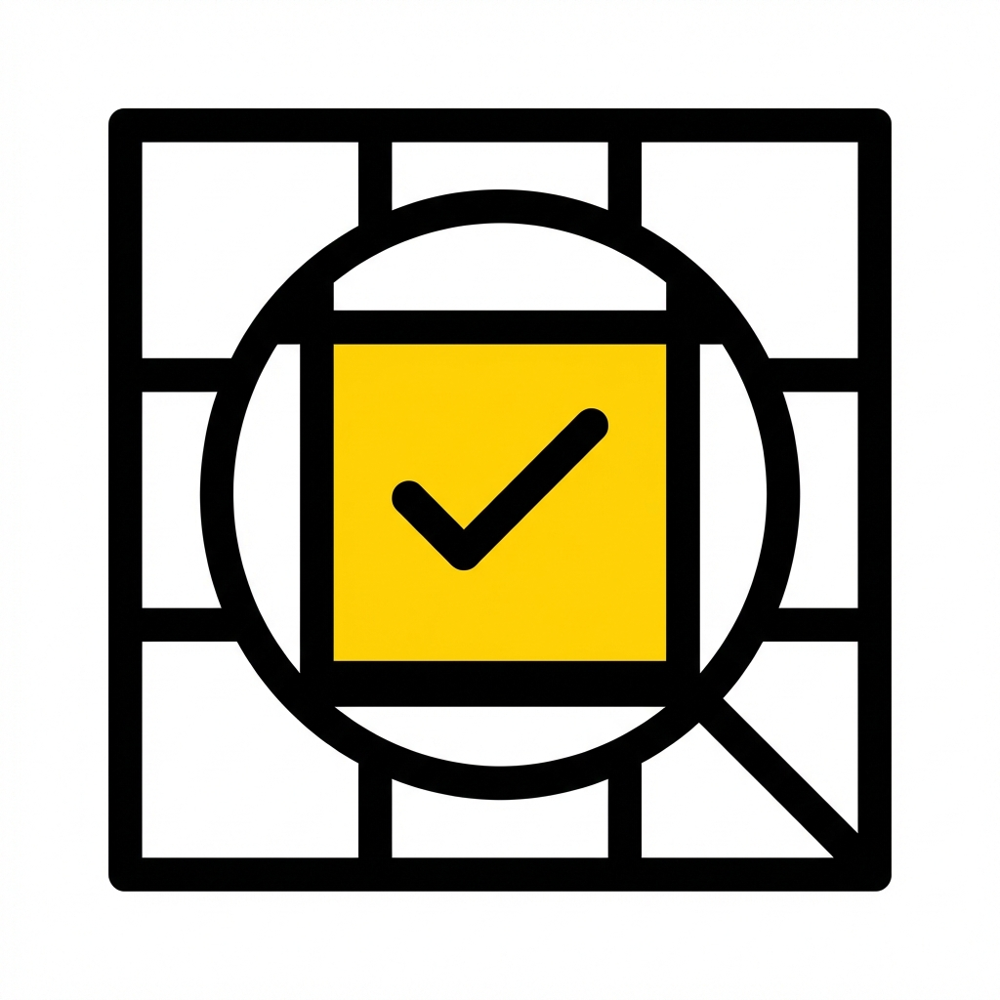
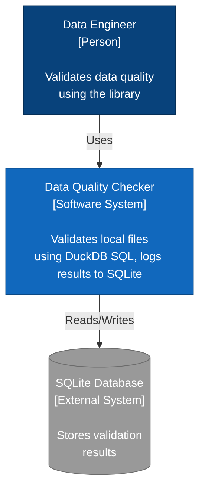
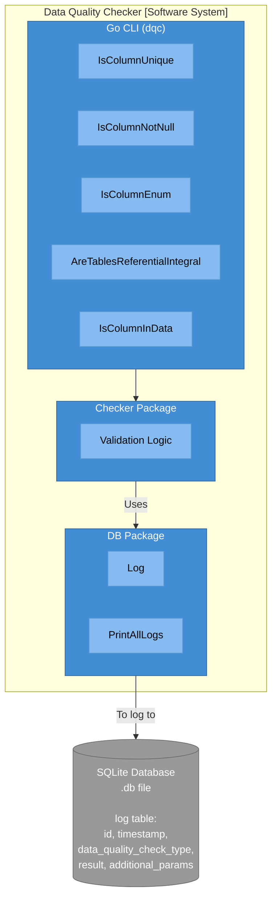

#  Data Quality Checker

A CLI tool and library for validating data quality on small to medium (< 50GB) datasets using pure SQL logic via DuckDB, with automated logging to SQLite.

## Features

- **SQL-Based Validation**: High-performance validation using DuckDB's pure SQL engine.
- **File-Based Inputs**: Directly validate CSV, Parquet, JSON, and more by passing their file paths.
- **Path Validation**: Automatically ensures input files exist before running checks.
- **Zero-Row Success Model**: Validation logic returns 0 rows on success and 1 or more rows on failure.
- **SQLite Logging**: Automated logging of all validation results with detailed metadata and timestamps.

### Included Data Quality Checks

1.  **Column Uniqueness**: Verifies if all values in a column are unique.
2.  **Null Value Detection**: Identifies if a column contains unexpected NULL values.
3.  **Enum Validation**: Ensures a column only contains values from a predefined list.
4.  **Referential Integrity**: Checks if values in a column exist in a reference table's column.
5.  **Column Existence**: Validates that a specific column exists in the dataset.
6.  **Value Range (`check-between`)**: Validates numeric values are within a [min, max] range.
7.  **Regex Match (`check-regex`)**: Validates string values match a RE2 regex pattern.
8.  **Type Validation (`check-type`)**: Checks if column data matches a specific DuckDB type.
9.  **Length Range (`check-length`)**: Validates string/object lengths are within range.
10. **Aggregate Bounds (`check-max`, `check-min`, `check-mean`, `check-median`)**: Validates aggregates are within range.
11. **Date Format (`check-date-format`)**: Validates strings match a specific strftime format.
12. **Table Row/Col Count (`check-row-count`, `check-col-count`)**: Validates table dimensions.
13. **Blacklist Validation (`check-not-in-set`)**: Ensures values are NOT in a "blacklisted" set.
14. **Ordering (`check-increasing`)**: Verifies values are in ascending order.
15. **Date Parseability (`check-date-parseable`)**: Checks if values can be parsed as dates.
16. **Column Level Equality (`check-pair-equal`)**: Compares two columns for equality per row.
17. **Set Coverage (`check-distinct-in-set`)**: Checks if all unique values are within a set.

## Installation

### Prerequisites
- Go >= 1.20
- GCC (refer to `go-duckdb` requirements)
- `CGO_ENABLED=1`

### Install with Go
```bash
go install github.com/josephmachado/data_quality_checker/cmd/dqc@latest
```

### Build from Source
```bash
# Clone the repository
git clone https://github.com/josephmachado/data_quality_checker.git
cd data_quality_checker

# Build the binary
go build -o dqc ./cmd/dqc
```

## Usage (Go)

The `dqc` CLI supports all checks.

### Examples

**Check for Uniqueness**
```bash
./dqc check-unique --data users.csv --column user_id
```

**Check for Non-Null Values**
```bash
./dqc check-not-null --data users.csv --column age
```

**Check Enum Values** (comma-separated)
```bash
./dqc check-enum --data users.csv --column status --enum-values active,inactive,pending
```

**Check Referential Integrity**
```bash
./dqc check-references --data orders.csv --reference users.csv --join-keys user_id
```

**Check Column Existence**
```bash
./dqc check-column-exists --data users.csv --column email
```

**View Logs**
```bash
./dqc show-logs
```

**Clean Logs**
```bash
./dqc clean-logs
```


## Architecture

### System Context Diagram (C4 Model - Level 1)



### Container Diagram (C4 Model - Level 2)



## Development (Go)

### Running Tests
```bash
go test ./...
```

### Project Structure

```text
data-quality-checker/
├── cmd/
│   └── dqc/
│       └── main.go       # CLI Entrypoint
├── internal/
│   ├── checker/          # Core Logic
│   │   ├── checker.go
│   │   └── checker_test.go
│   └── db/               # Database Logic
│       ├── connector.go
│       └── connector_test.go
├── tests/                # Test Data
│   └── data/
├── go.mod
├── README.md
└── LICENSE
```