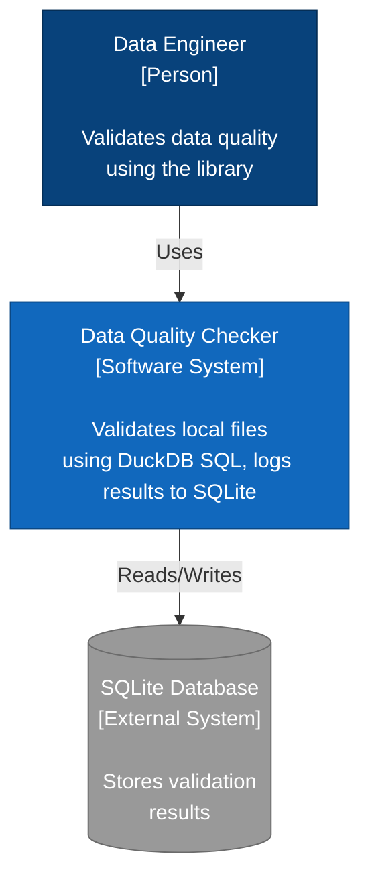
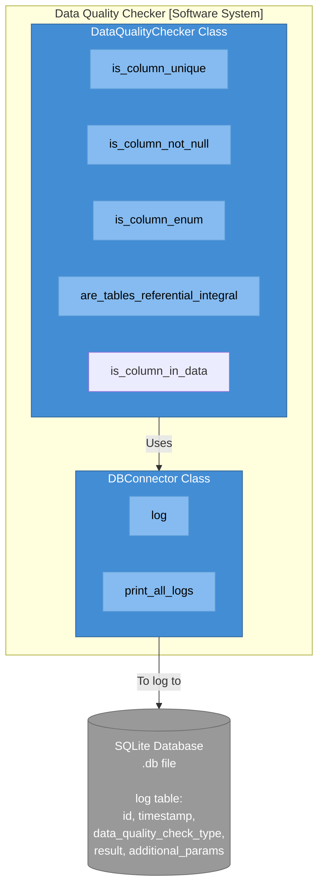

#  Data Quality Checker

A Python library for validating data quality on small to medium (< 50GB) datasets using pure SQL logic via DuckDB, with automated logging to SQLite.

## Installation

### From PyPI
```bash
pip install --index-url https://test.pypi.org/simple/ data-quality-checker
```

### From Source
```bash
# Clone the repository
git clone https://github.com/josephmachado/data_quality_checker.git
cd data_quality_checker

# Install with uv
uv sync

# Run tests
uv run pytest
```

## Features

- **SQL-Based Validation**: High-performance validation using DuckDB's pure SQL engine.
- **File-Based Inputs**: Directly validate CSV, Parquet, JSON, and more by passing their file paths.
- **Path Validation**: Automatically ensures input files exist before running checks.
- **Zero-Row Success Model**: Validation logic returns 0 rows on success and 1 or more rows on failure.
- **SQLite Logging**: Automated logging of all validation results with detailed metadata and timestamps.

### Included Data Quality Checks

1.  **Column Uniqueness**: Verifies if all values in a column are unique.
2.  **Null Value Detection**: Identifies if a column contains unexpected NULL values.
3.  **Enum Validation**: Ensures a column only contains values from a predefined list.
4.  **Referential Integrity**: Checks if values in a column exist in a reference table's column.
5.  **Column Existence**: Validates that a specific column exists in the dataset.

## Usage

### Sample Data

The examples below use two CSV files, `users.csv` and `orders.csv`, with the following structure:

**users.csv**
| user_id | email | status | age |
| :--- | :--- | :--- | :--- |
| 1 | alice@example.com | active | 25 |
| 2 | bob@example.com | active | 30 |
| 3 | charlie@example.com | inactive | *null* |

**orders.csv**
| order_id | user_id | amount |
| :--- | :--- | :--- |
| 101 | 1 | 100.0 |
| 102 | 2 | 250.0 |

### Basic Example

This example shows how to use the library to validate local CSV files. Note how we use DuckDB to quickly create sample data files for this demonstration.

```python
from pathlib import Path
import duckdb
from data_quality_checker.connector.output_log import DBConnector
from data_quality_checker.main import DataQualityChecker

# 1. Create dummy data for the example
duckdb.sql("""
    COPY (SELECT 1 as user_id, 'alice@example.com' as email, 'active' as status, 25 as age
          UNION ALL SELECT 2, 'bob@example.com', 'active', 30
          UNION ALL SELECT 3, 'charlie@example.com', 'inactive', NULL) 
    TO 'users.csv' (HEADER, DELIMITER ',')
""")

duckdb.sql("""
    COPY (SELECT 101 as order_id, 1 as user_id, 100.0 as amount
          UNION ALL SELECT 102, 2, 250.0) 
    TO 'orders.csv' (HEADER, DELIMITER ',')
""")

# 2. Initialize database connector
db_connector = DBConnector(Path("quality_checks.db"))

# 3. Create data quality checker
checker = DataQualityChecker(db_connector)

# 4. Run validation checks
is_unique = checker.is_column_unique("users.csv", "user_id")
print(f"User ID unique: {is_unique}")

no_nulls = checker.is_column_not_null("users.csv", "age")
print(f"Age has no nulls: {no_nulls}")

valid_status = checker.is_column_enum(
    "users.csv", 
    "status", 
    ["active", "inactive", "pending"]
)
print(f"Status values valid: {valid_status}")

referential_integrity = checker.are_tables_referential_integral(
    "orders.csv",
    "users.csv",
    ["user_id"]
)
print(f"Referential integrity: {referential_integrity}")

column_exists = checker.is_column_in_data("users.csv", "email")
print(f"Email column exists: {column_exists}")

# 5. View all logged validation results
print("\nValidation History:")
db_connector.print_all_logs()
```
### Expected Output

```
User ID unique: True
Age has no nulls: False
Status values valid: True
Referential integrity: True
Email column exists: True

Validation History:
ID    Timestamp                  Check Type                          Result   Additional Params
------------------------------------------------------------------------------------------------------------------------
1     2026-01-26T14:00:00.000000 is_column_unique                    PASS     {'column': 'user_id', 'data_path': 'users.csv', 'error_count': 0}
2     2026-01-26T14:00:00.100000 is_column_not_null                  FAIL     {'column': 'age', 'data_path': 'users.csv', 'error_count': 1}
3     2026-01-26T14:00:00.200000 is_column_enum                      PASS     {'column': 'status', 'enum_values': ['active', 'inactive', 'pending'], 'data_path': 'users.csv', 'error_count': 0}
4     2026-01-26T14:00:00.300000 are_tables_referential_integral     PASS     {'join_keys': ['user_id'], 'data_path': 'orders.csv', 'reference_path': 'users.csv', 'error_count': 0}
5     2026-01-26T14:00:00.400000 is_column_in_data                  PASS     {'column': 'email', 'data_path': 'users.csv'}
```

Don't forget to remove the quality_checks.db file after running the example.

```bash
rm -rf quality_checks.db
```

### CLI Usage

The library also exposes a CLI tool `dqc` that supports all the checks. 
If you installed via `pip`, you can use `dqc` directly. If you are using `uv`, prefix with `uv run`.

#### Key Flags
- `--data`: Path to the input file.
- `--column`: Name of the primary column to check.
- `--db-path`: (Optional) Path to the SQLite DB (default: `quality_checks.db`).

#### Examples

**Check for Uniqueness**
```bash
uv run dqc check-unique --data users.csv --column user_id
```

**Check for Non-Null Values**
```bash
uv run dqc check-not-null --data users.csv --column age
```

**Check Enum Values** (comma-separated list for valuse)
```bash
uv run dqc check-enum --data users.csv --column status --enum-values active,inactive,pending
```

**Check Referential Integrity**
```bash
uv run dqc check-references --data orders.csv --reference users.csv --join-keys user_id
```

**Check Column Existence**
```bash
uv run dqc check-column-exists --data users.csv --column email
```

**View Logs**
```bash
uv run dqc show-logs
```

## API Reference

### DataQualityChecker

#### `is_column_unique(data_path: str, unique_column: str) -> bool`
Checks if all values in the specified column are unique by grouping and counting.

#### `is_column_not_null(data_path: str, not_null_column: str) -> bool`
Checks if the specified column contains no null values using `IS NULL`.

#### `is_column_enum(data_path: str, enum_column: str, enum_values: list[str]) -> bool`
Validates that all values in the column match the allowed set of values using `NOT IN`.

#### `are_tables_referential_integral(data_path: str, reference_path: str, join_keys: list[str]) -> bool`
Checks referential integrity between two data files using a `LEFT JOIN` and checking for nulls in the reference table.

#### `is_column_in_data(data_path: str, column_name: str) -> bool`
Checks if the specified column exists in the data file by attempting a zero-row selection.

### DBConnector

#### `log(data_quality_check_type: str, result: bool, **kwargs) -> None`

Logs a validation result to the SQLite database.

#### `print_all_logs() -> None`

Prints all logged validation results in a formatted table.

## Architecture

### System Context Diagram (C4 Model - Level 1)



### Container Diagram (C4 Model - Level 2)



## Development

### Setup Development Environment
```bash
# Clone repository
git clone https://github.com/josephmachado/data_quality_checker.git
cd data_quality_checker

# Install dependencies
uv sync --group dev

# Run type checks
uv run pyrefly check

# Run tests
uv run pytest

# Run tests with coverage
uv run pytest --cov=data_quality_checker --cov-report=term-missing

# Run tests verbosely
uv run pytest -v
```

### Project Structure
```
data-quality-checker/
├── src/
│   └── data_quality_checker/
│       ├── __init__.py
│       ├── main.py
│       └── connector/
│           ├── __init__.py
│           └── output_log.py
├── tests/
│   ├── conftest.py
│   └── unit/
│       ├── test_data_quality_checker.py
│       └── test_db_connector.py
├── pyproject.toml
├── README.md
└── LICENSE
```

### Building and Publishing
```bash
# Build the package
uv build

# Publish to PyPI
uv publish

# Publish to Test PyPI
uv publish --publish-url https://test.pypi.org/legacy/
```

## Requirements

- Python >= 3.13
- duckdb >= 1.1.0

## Contributing

Contributions are welcome! Please feel free to submit a Pull Request.

1. Fork the repository
2. Create your feature branch (`git checkout -b feature/amazing-feature`)
3. Commit your changes (`git commit -m 'Add some amazing feature'`)
4. Push to the branch (`git push origin feature/amazing-feature`)
5. Open a Pull Request
