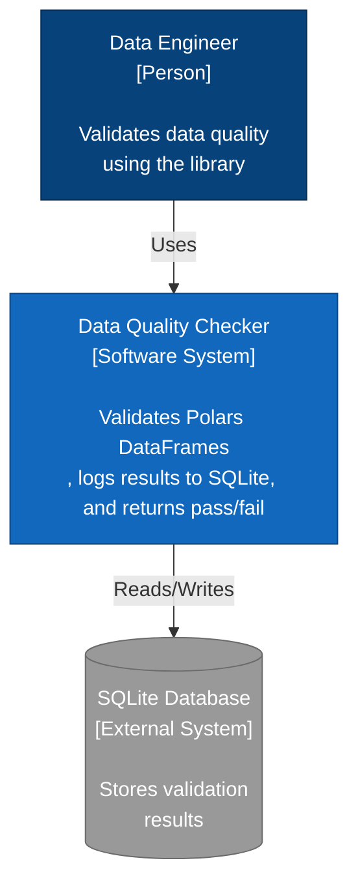
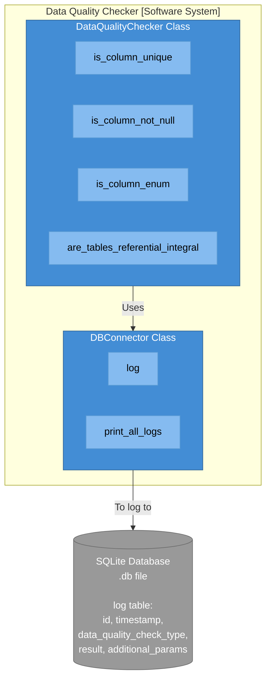

# Data Quality Checker

A Python library for validating data quality or small to medium (< 50GB) datasets with Polars DataFrames with automated logging to SQLite.

## Installation

### From PyPI
```bash
pip install data-quality-checker
```

### From Source
```bash
# Clone the repository
git clone https://github.com/josephmachado/data-quality-checker.git
cd data-quality-checker

# Install with uv
uv sync

# Run tests
uv run pytest
```

## Features

- Column Uniqueness Validation
- Null Value Detection
- Enum/Categorical Value Validation
- Referential Integrity Checks
- Automatic SQLite Logging with Timestamps
- Query Historical Validation Results

## Usage

### Basic Example
```python
from pathlib import Path
import polars as pl
from data_quality_checker.connector.output_log import DBConnector
from data_quality_checker.main import DataQualityChecker

# Initialize database connector
db_connector = DBConnector(Path("quality_checks.db"))

# Create data quality checker
checker = DataQualityChecker(db_connector)

# Sample DataFrames
users_df = pl.DataFrame({
    "user_id": [1, 2, 3, 4, 5],
    "email": ["alice@example.com", "bob@example.com", "charlie@example.com", 
              "david@example.com", "eve@example.com"],
    "status": ["active", "active", "inactive", "active", "pending"],
    "age": [25, 30, None, 35, 28]
})

orders_df = pl.DataFrame({
    "order_id": [101, 102, 103, 104],
    "user_id": [1, 2, 1, 3],
    "amount": [100.0, 250.0, 75.0, 150.0]
})

# Run validation checks
is_unique = checker.is_column_unique(users_df, "user_id")
print(f"User ID unique: {is_unique}")

no_nulls = checker.is_column_not_null(users_df, "age")
print(f"Age has no nulls: {no_nulls}")

valid_status = checker.is_column_enum(
    users_df, 
    "status", 
    ["active", "inactive", "pending"]
)
print(f"Status values valid: {valid_status}")

referential_integrity = checker.are_tables_referential_integral(
    orders_df,
    users_df,
    ["user_id"]
)
print(f"Referential integrity: {referential_integrity}")

# View all logged validation results
print("\nValidation History:")
db_connector.print_all_logs()
```

### Expected Output
```
User ID unique: True
Age has no nulls: False
Status values valid: True
Referential integrity: True

Validation History:
ID    Timestamp                  Check Type                          Result   Additional Params
------------------------------------------------------------------------------------------------------------------------
1     2026-01-19T14:30:45.123456 is_column_unique                    PASS     {'column': 'user_id', 'total_rows': 5, 'unique_rows': 5}
2     2026-01-19T14:30:45.234567 is_column_not_null                  FAIL     {'column': 'age', 'null_count': 1, 'total_rows': 5}
3     2026-01-19T14:30:45.345678 is_column_enum                      PASS     {'column': 'status', 'enum_values': ['active', 'inactive', 'pending'], 'invalid_values': None}
4     2026-01-19T14:30:45.456789 are_tables_referential_integral     PASS     {'join_keys': ['user_id'], 'total_rows': 4, 'matched_rows': 4, 'orphaned_rows': 0}
```

## API Reference

### DataQualityChecker

#### `is_column_unique(data_frame_to_validate: pl.DataFrame, unique_column: str) -> bool`

Checks if all values in the specified column are unique.

**Parameters:**
- `data_frame_to_validate`: Polars DataFrame to validate
- `unique_column`: Name of the column to check for uniqueness

**Returns:** `True` if all values are unique, `False` otherwise

#### `is_column_not_null(data_frame_to_validate: pl.DataFrame, not_null_column: str) -> bool`

Checks if the specified column contains no null values.

**Parameters:**
- `data_frame_to_validate`: Polars DataFrame to validate
- `not_null_column`: Name of the column to check for nulls

**Returns:** `True` if no null values exist, `False` otherwise

#### `is_column_enum(data_frame_to_validate: pl.DataFrame, enum_column: str, enum_values: list[str]) -> bool`

Validates that all values in the column match the allowed set of values.

**Parameters:**
- `data_frame_to_validate`: Polars DataFrame to validate
- `enum_column`: Name of the column to check
- `enum_values`: List of allowed values

**Returns:** `True` if all values are in the allowed set, `False` otherwise

#### `are_tables_referential_integral(data_frame_to_validate: pl.DataFrame, data_frame_to_validate_against: pl.DataFrame, join_keys: list[str]) -> bool`

Checks referential integrity between two DataFrames.

**Parameters:**
- `data_frame_to_validate`: DataFrame with foreign keys
- `data_frame_to_validate_against`: DataFrame with primary keys
- `join_keys`: List of column names to join on

**Returns:** `True` if all foreign keys exist in the reference table, `False` otherwise

### DBConnector

#### `log(data_quality_check_type: str, result: bool, **kwargs) -> None`

Logs a validation result to the SQLite database.

**Parameters:**
- `data_quality_check_type`: Type of validation performed
- `result`: Boolean result of the validation
- `**kwargs`: Additional metadata about the validation

#### `print_all_logs() -> None`

Prints all logged validation results in a formatted table.

## Architecture

### System Context Diagram (C4 Model - Level 1)



### Container Diagram (C4 Model - Level 2)



## Development

### Setup Development Environment
```bash
# Clone repository
git clone https://github.com/yourusername/data-quality-checker.git
cd data-quality-checker

# Install dependencies
uv sync --group dev

# Run tests
uv run pytest

# Run tests with coverage
uv run pytest --cov=data_quality_checker --cov-report=term-missing

# Run tests verbosely
uv run pytest -v
```

### Project Structure
```
data-quality-checker/
├── src/
│   └── data_quality_checker/
│       ├── __init__.py
│       ├── main.py
│       └── connector/
│           ├── __init__.py
│           └── output_log.py
├── tests/
│   ├── conftest.py
│   └── unit/
│       ├── test_data_quality_checker.py
│       └── test_db_connector.py
├── pyproject.toml
├── README.md
└── LICENSE
```

### Building and Publishing
```bash
# Build the package
uv build

# Publish to PyPI
uv publish

# Publish to Test PyPI
uv publish --publish-url https://test.pypi.org/legacy/
```

## Requirements

- Python >= 3.13
- polars >= 1.37.1

## Contributing

Contributions are welcome! Please feel free to submit a Pull Request.

1. Fork the repository
2. Create your feature branch (`git checkout -b feature/amazing-feature`)
3. Commit your changes (`git commit -m 'Add some amazing feature'`)
4. Push to the branch (`git push origin feature/amazing-feature`)
5. Open a Pull Request
